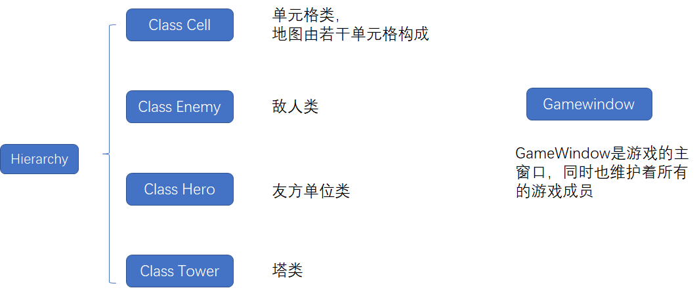
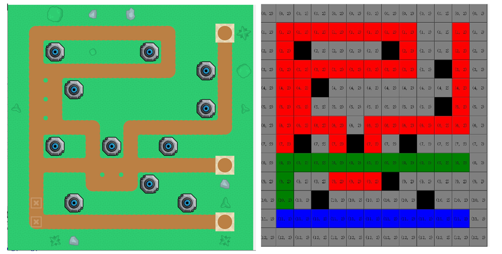
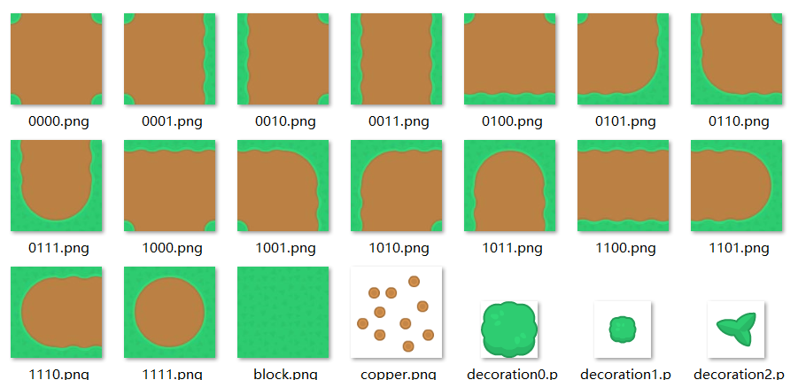
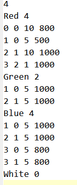
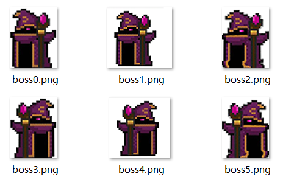
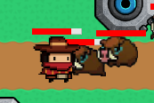
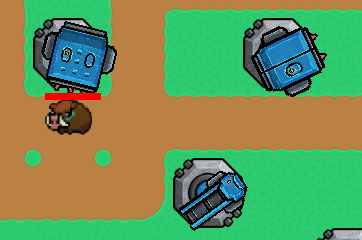
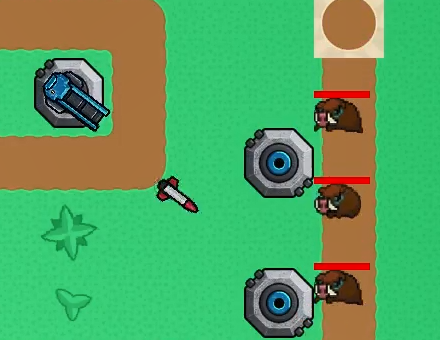
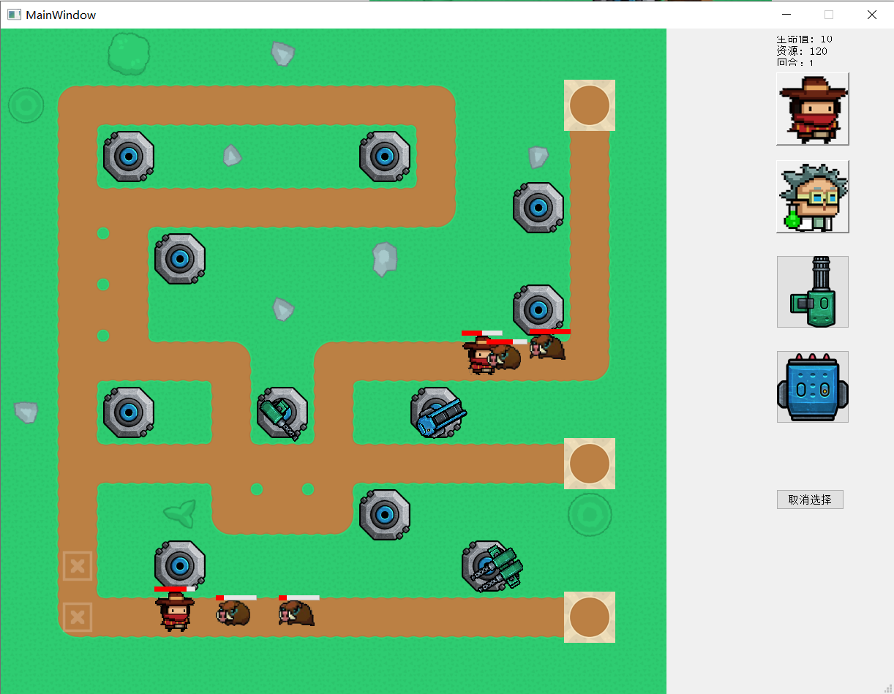

# 塔防TowerDefenseGame

项目基于Qt5.14.2编写

## 一、项目架构



### 0）前述

Qt作为一个不错的GUI编写工具，在游戏编写上稍显乏力，相比成型的游戏引擎，缺少很多实用的封装（如缺少帧的概念、没有协程之类）。

本项目中为每一个类设置**Update函数**，设置一个FPS帧率（30帧）与对应的QTimer。gamewindow管理所有元素，每次QTimer的`timeout`信号发出时，触发槽函数，调用所有的Update函数，依此实现一个方便管理的**30帧简易游戏引擎**。

### 1）地图

地图由若干个单元格构成，单元格有**道路、阻隔、放置处**三种大种类、9个细分，可以通过位运算进行区分和组合。Gamewindow类中维护着一个`QVector<QVector<Cell*>> cells`作为地图。

```C++
enum CellType {Path=0x10, Red=0x11, Green=0x12, Blue=0x14, White=0x18,  //可移动路径
               Start=0x3f, End=0x5f,                                    //始末格
               Blocked=0x100,                                           //阻碍
               Placable=0x1000                                         //可放置塔
                };
```

由于Project的手册要求可以规定路径而不是寻找最短路，所以本项目**采用路径的方式描述地图**，最多容纳四条可交叉的路径（Red, Green, Blue, White）。

如果一个单元格既可以作为红色也可以作为绿色，那么它的`cellType = 0x11 & 0x12`。

#### 地图生成器

经过我的一番网上冲浪，找到了比较合适的美术素材，并经过一番PS魔改之后，得到了**可自由组合的地图素材**，因而我顺便实现了地图生成器，通过点击对应的单元格确定最多四条线路，即可生成对应的地图，而不用局限于一张确定的地图。下图为地图绘制界面与生成的地图：



生成的逻辑用了一些Trick值得提一提，地图**根据上下左右是否连通用一个四位二进制数**命名，在导入地图文件之后，遍历所有单元格，确定其美术素材



有的单元格上还有装饰物、塔基座等其他图片，通过编写一个`MergeImage`函数来融合两张QImage。（地图上的装饰是随机生成的。）

### 2）回合逻辑

怪物的出生通过一个RoundConfig文件来确定，文件中交代了一共几个回合，每个回合在哪一个出生点生成哪些怪物、生成多少、生成间隔多少。代码实现上，定义了一个EnemyConfig类，保存在struct Round中，游戏中进行读取。每一回合的怪物被消灭完，自动进入下一回合。



**游戏结束条件**为所有回合完成，或者到达终点的怪物过多导致生命值耗尽，则游戏结束。

### 3）怪物(class Enemy)

怪物类为了方便使用图片，继承自QLabel，拥有生命值、攻击力、攻击范围、移动速度、到达终点会造成的伤害、攻击间隔等一系列成员变量。

每一个怪物拥有一个指针，指向它将在map的哪条道路上移动。

怪物有一个status成员，表征它正在移动还是正在发动进攻。

这里我没有为每一种怪物新建一个类，因为每一个怪物之间的差别不大，如果需要为怪物增加特殊能力，则需要考虑进行继承操作。

#### 关于怪物移动

Moving状态下，怪物会向着路径的下一格中心移动，具体到代码实现上，舍弃了QPropertyAnimation的思路，而是采用每次Update函数调用时，用速度乘以时间算出距离，乘上对应的sin,cos值算出xy偏移量的方法更新位置。

由于游戏30帧的特性，虽然每帧移动是间断的，但在用户看来仍然是连续的，不会出现跳跃的现象。

#### 如何让怪物的动作不再僵硬

简单的平行移动肯定是不自然的，我又经过一番网上冲浪，从元气骑士那里找到了些图片。每一个怪物有一个QTimer，会每隔几百毫秒循环切换图片，形成怪物自然的走路效果。



#### 关于怪物攻击

怪物会在Update函数中调用GameWindow接口，查询它攻击范围内的cell上是否有可用英雄，如果有，则和英雄之间互相确认，改变到Fighting状态，通过一个QTimer，每隔`attackInterval` 时间发动一次攻击。

#### 关于血量条

为了良好的游戏体验，英雄和怪物都设置了血量条，实现上就是一个QProgressBar，将位置固定在怪物上方。



### 4）英雄(class Hero)

英雄除了血量、攻击、价格等等属性之外，还有一个**可容纳怪物数量**，当怪物尝试进入Fighting状态，Hero会看容量是否达到上限，如果是则不再接收新的怪物，否则接收，怪物进入Fighting状态。

由于可能的拓展要求，每一个英雄都采用继承的方式创建了独立的类。

P.S.: 英雄与怪物在实现上大同小异，其实本可以再抽象一个LivingUnit类。

#### 关于攻击

英雄的攻击有独立的算法，并不一定攻击困住的几个怪物，这也是为了方便拓展为类似**地刺**的属性。

#### 英雄的动作、血量条实现同上

### 5）塔

塔的属性相对简单，有花费、等级、攻击范围、伤害、攻击间隔，并有目标指针、所处位置、子弹属性、图片素材等其他成员。



#### 塔的攻击

塔的Update函数中，会遍历所有存活的敌人，如果找到一个攻击范围内的敌人，就会记录下来。如果目标不为空，则会启动Attack对应的Timer，每隔一段时间**发射一枚弹药**，**当弹药击中目标时造成伤害**。

#### 灵动而自然的塔

塔没有移动方法，因而为了不显得无聊，塔会旋转朝向它的目标，这是通过旋转图片素材实现的。每一帧中，塔会更新它的图片，用QPixmap的Rotate方法，朝向目标。

#### 塔的升级

每一种塔有三级，升级会改变形态，得到攻击力等属性的提高

### 6）子弹

子弹设置为了一个单独的类，便于在攻击中调整朝向，显得更加自然，判定也更加准确。子弹有两个指针，记录发射者与目标，当目标死亡或者击中时销毁，并发送`HitEnemy信号`造成伤害。



#### 子弹的飞行

子弹飞行**综合了怪物移动算法与塔的旋转算法**，实现了从源头到目标的曲线飞行，同时弹头始终瞄准敌人

### 7）点击放置的实现（交互）



目前采用的放置算法步骤如下：

1. 右侧有四个QPushButton，按下后如果金钱足够则进入**放置等待状态**
2. 地图上的所有QLabel监听MousePress事件，并connect到处理函数，如果被**按下且目标匹配则做出相应操作**（如等待放置的是塔，被按下的QLabel是塔则升级，是Placable则放置，是其他目标则不做任何行为。英雄同理）

